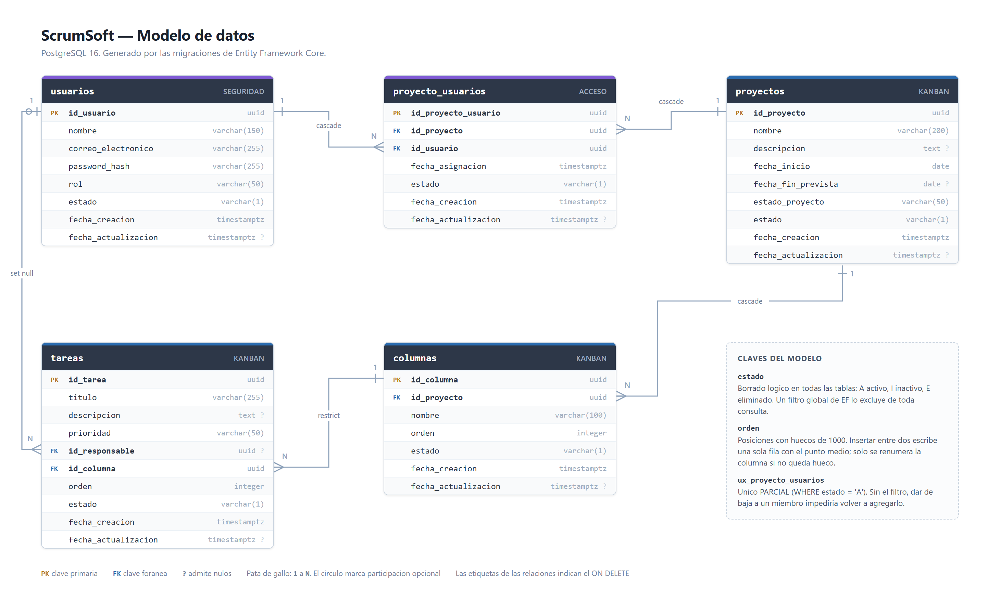

# ScrumSoft

Gestor de proyectos agiles con tablero kanban en tiempo real: proyectos, columnas
configurables, tareas que se arrastran entre columnas con el orden persistido,
sincronizacion entre sesiones y reportes en PDF y Excel.

| | |
|---|---|
| **Frontend** | Angular 17 (NgModules), TypeScript, SCSS, PrimeNG 17 sobre la plantilla Sakai |
| **Backend** | .NET 8, arquitectura hexagonal, API RESTful |
| **Persistencia** | Entity Framework Core con migraciones incrementales |
| **Base de datos** | PostgreSQL 16 |
| **Tiempo real** | SignalR |
| **Reportes** | QuestPDF (PDF) y ClosedXML (Excel) |
| **Despliegue** | Docker Compose: base de datos, API y SPA servida por nginx |

---

## Puesta en marcha

Solo hace falta Docker. Desde la raiz del repositorio:

```bash
cp .env.example .env
docker compose up -d --build
```

El `.env.example` **ya trae valores funcionales**: se copia tal cual y se levanta,
sin editar nada. Son credenciales de evaluacion local.

La primera vez tarda unos minutos porque compila las dos imagenes. Cuando termine:

| | URL | Para que |
|---|---|---|
| **Aplicacion** | http://localhost:8086 | es por donde se usa todo |
| Swagger | http://localhost:8085/swagger | inspeccionar la API a mano |
| PostgreSQL | — | no se publica: vive en la red interna de Docker |

### Iniciar sesion

| Correo | Contrasena | Rol |
|---|---|---|
| admin@scrumsoft.com | `Admin123*` | Administrador |
| miembro@scrumsoft.com | `Miembro123*` | Miembro |

Las migraciones se aplican solas al arrancar la API, incluidos estos usuarios y
los datos de ejemplo. **No hay ningun paso previo de base de datos.**

El checkbox **Recordarme** del login decide el alcance de la sesion: marcado,
se guarda en `localStorage` y se comparte entre todas las pestanas del
navegador; desmarcado, va a `sessionStorage`, que vive por pestana, asi que una
pestana nueva pide iniciar sesion otra vez. Es el comportamiento elegido, no un
fallo. En ambos casos el token expira a los 60 minutos.

### Si un puerto esta ocupado

Se cambia en el `.env` y se vuelve a levantar. No hay que recompilar nada: la SPA
pide rutas relativas y no lleva ninguna direccion dentro.

```bash
WEB_PUERTO=8090
API_PUERTO=9000
```

### Detener

```bash
docker compose down       # conserva los datos
docker compose down -v    # borra tambien la base
```

---

## Que hay al entrar

La base viene sembrada para que se pueda probar sin dar de alta nada:

**Plataforma ScrumSoft** — cuatro columnas (Backlog, En progreso, En revision,
Hecho) y ocho tareas con las cuatro prioridades, algunas sin responsable.
**Los dos usuarios son miembros**, asi que sirve para probar el tiempo real con
dos sesiones distintas.

**Portal de clientes** — tres columnas y dos tareas. **Solo el administrador es
miembro**: entrando como `miembro@scrumsoft.com` este proyecto no aparece, que es
el control de acceso funcionando.

## Como comprobar cada requisito

| Que | Donde |
|---|---|
| Arrastre entre columnas y dentro de una | Tablero. La tarjeta se mueve al instante y el orden se guarda |
| El orden persiste | Mover una tarjeta, recargar con F5, y volver a entrar desde otro navegador |
| Reversion si el servidor falla | Detener la api (`docker compose stop api`) y arrastrar: la tarjeta vuelve a su sitio con un aviso |
| **Tiempo real** | Abrir dos navegadores, uno con cada usuario, los dos en *Plataforma ScrumSoft*. Mover una tarjeta en el primero se refleja en el segundo |
| Usuarios conectados | Con las dos sesiones abiertas, la cabecera del tablero muestra quien esta mirando |
| No se reciben eventos de otros tableros | Con el segundo usuario en otro proyecto, los cambios del primero no le llegan |
| Reportes | Boton **Reporte** del tablero, en PDF y Excel. Con filtros puestos, el archivo trae lo mismo que la pantalla |
| Regla de negocio del backend | Intentar borrar una columna con tareas: la API responde 400 y la interfaz muestra el motivo |
| Control de acceso | Entrar como miembro: *Portal de clientes* no existe para el |
| Filtros y busqueda | Cabecera del tablero: responsable, prioridad y texto |

---

## Desarrollo sin Docker

```bash
# backend  ->  https://localhost:7086
cd scrumSoft-back/ScrumSoft.Api
dotnet user-secrets set "ConnectionStrings:ScrumSoft" "Host=localhost;Database=scrumsoft;Username=postgres;Password=postgres"
dotnet user-secrets set "Jwt:Clave" "una-clave-de-al-menos-32-caracteres-aqui"
dotnet run

# frontend  ->  http://localhost:4200
cd scrumSoft-ng
npm install
npm start
```

`appsettings.json` tiene la cadena de conexion y la clave del JWT **vacias a
proposito**: no se versionan secretos. Si faltan, la API no arranca y dice cual
falta en vez de fallar con un error de red en la primera peticion.

En este modo la SPA llama a la API por su puerto, que es otro origen, y ahi si
entra CORS: el backend permite `http://localhost:4200`, configurable por
`Cors:Origenes`.

Cada subproyecto tiene su propio README con mas detalle:
**[backend](scrumSoft-back/README.md)** y **[frontend](scrumSoft-ng/README.md)**.

---

## Estructura

```
PRY/
├── docker-compose.yml     base de datos + api + web
├── .env.example           valores funcionales por defecto
├── scrumSoft-back/        API .NET 8 (hexagonal)
└── scrumSoft-ng/          SPA Angular 17
```

Los dos subproyectos venian de repositorios separados y se unieron con
`git subtree`, por eso el historial conserva los commits originales con sus fechas.

### Backend: hexagonal

```
        ScrumSoft.Api  ──────┐          controladores, middleware, composicion
                             ▼
ScrumSoft.Infrastructure ──► ScrumSoft.Application ──► ScrumSoft.Domain
   adaptadores                 casos de uso                entidades
                               y PUERTOS                   y reglas
```

La dependencia siempre apunta hacia adentro. El dominio no conoce EF, ni HTTP, ni
SignalR. Los puertos son interfaces en `Application/Ports/` y sus implementaciones
viven en `Infrastructure/`.

### Frontend: separacion por capas

`common/` lo transversal (sesion, HTTP, guards, interceptor), `services/` el
negocio, `models/` y `enums/` los contratos, y `pages/` las pantallas, que no
saben de HTTP. Cada pantalla sigue el patron contenedor / presentacionales: el
contenedor tiene el estado y las llamadas, los hijos reciben por `@Input` y avisan
por `@Output`.

---

## Modelo de datos



Cinco tablas. Un **proyecto** tiene columnas y miembros; una **columna** tiene
tareas; una **tarea** apunta a su columna y, opcionalmente, a un responsable.
`proyecto_usuarios` resuelve la relacion muchos a muchos entre usuarios y
proyectos, y es la que decide quien ve que.

Detalles que no se leen en el diagrama:

- **Borrado logico en todas las tablas.** La columna `estado` (`A` activo,
  `I` inactivo, `E` eliminado) marca la fila en vez de perderla, y un filtro global
  de EF la excluye de todas las consultas.
- **El indice unico de membresias es parcial**, con `WHERE estado = 'A'`. Sin ese
  filtro, sacar a alguien de un proyecto haria imposible volver a agregarlo: la
  fila de baja seguiria ocupando la combinacion. Asi las bajas quedan como
  historial de quien estuvo en el equipo.
- **Auditoria automatica**: un interceptor de EF rellena `fecha_creacion` y
  `fecha_actualizacion` al guardar, sin que ningun caso de uso tenga que acordarse.

Las migraciones estan en `scrumSoft-back/ScrumSoft.Infrastructure/Persistence/Migrations/`
y son incrementales: la base se construye desde cero ejecutandolas en orden, que
es lo que hace la API al arrancar.

| Migracion | Que aporta |
|---|---|
| `EsquemaInicial` | Tablas, relaciones, indices y los dos usuarios |
| `IndiceParcialDeMembresias` | El indice unico parcial descrito arriba |
| `SemillaDeDemostracion` | Los proyectos, columnas y tareas de ejemplo |

El modelo tambien esta escrito en notacion DBML en
[`scrumSoft-back/docs/modelo-datos.dbml`](scrumSoft-back/docs/modelo-datos.dbml),
con los tipos, los indices y el comportamiento de borrado de cada relacion.

---

# Decisiones arquitectonicas

## 1. La SPA y la API comparten origen, detras de nginx

La imagen del frontend no es un servidor de desarrollo: compila la SPA con Node y
la sirve con **nginx**, que ademas hace de **proxy inverso** hacia la API. nginx
enruta por ruta:

| Peticion | Destino |
|---|---|
| `/api/...` | contenedor de la API |
| `/hubs/...` | contenedor de la API, con las cabeceras de `Upgrade` para el WebSocket |
| cualquier otra | `index.html`, y enruta Angular |

Por eso `environment.prod.ts` lleva `urlBackend: ''` y todas las peticiones salen
relativas. Para el navegador solo existe un servidor: el mismo que le sirvio la
pagina.

**Por que, y no una URL absoluta con CORS.** La alternativa funciona en local, pero
`localhost` compilado en el bundle apunta al PC de cada visitante, no al servidor:
habria que meter la direccion publica en el build y generar **un artefacto por
entorno**. Ademas obligaria a mantener la URL publica del frontend en el backend
(lista de origenes) y la del backend en el frontend — cada uno teniendo que
conocer la direccion del otro, y las dos cambiando en cada despliegue. Con el proxy
ninguno sabe nada del otro y el mismo artefacto sirve en cualquier host o puerto.

Y con HTTPS deja de ser opcional: dos dominios significan dos certificados, y una
SPA servida por `https` no puede llamar a una API por `http` — el navegador lo
bloquea por contenido mixto antes de que CORS entre siquiera en juego.

Nota sobre CORS: no se configuro para esquivarlo, **se elimino la situacion**. Al
no haber peticion cruzada, la regla no llega a aplicarse. El backend igual tiene
CORS configurado, pero solo lo necesita el modo de desarrollo con `npm start`.

**Alternativa descartada**: el proxy del `ng serve` (`proxy.conf.json`). Es solo
para desarrollo y obligaria a mantener la direccion de la API en dos sitios.

## 2. Tiempo real con SignalR

**Elegido SignalR** por tres razones concretas del problema:

1. **Grupos por proyecto.** Cada sesion se suscribe al grupo de su tablero, y al
   cambiar de proyecto se sale del anterior. Eso es lo que hace que una sesion no
   reciba eventos de tableros que no esta mirando — con WebSocket crudo habria que
   escribir esa gestion a mano.
2. **Reconexion y transporte negociado.** Si el WebSocket no esta disponible cae a
   Server-Sent Events o long polling sin cambiar una linea de codigo, y se
   reconecta solo tras un corte.
3. **La misma autenticacion.** El hub valida el mismo JWT de la sesion. Como un
   WebSocket no puede enviar cabeceras, el token viaja en la cadena de consulta,
   y el servidor **solo lo acepta para rutas que empiezan por `/hubs`**: en el
   resto de la API sigue siendo obligatoria la cabecera `Authorization`, para no
   dejar tokens escritos en los logs de acceso de cualquier proxy.

**WebSocket crudo — descartado.** Da el canal, pero no la agrupacion por tablero,
ni la reconexion, ni el respaldo cuando el WebSocket esta bloqueado, ni la
integracion con la autenticacion. Seria reescribir SignalR peor.

**Server-Sent Events — descartado.** Es unidireccional (servidor a cliente), asi
que suscribirse y desuscribirse necesitaria endpoints HTTP aparte. Ademas el
navegador limita las conexiones abiertas por dominio en HTTP/1.1, y una pestaña
por tablero se acerca peligrosamente a ese tope.

**Sondeo periodico — descartado.** Cumplir "menos de dos segundos" obligaria a
preguntar cada segundo por cada sesion abierta, casi siempre para que no haya
nada nuevo.

### Como se aplican los eventos

Los eventos del hub se aplican en el cliente **con los mismos metodos que las
respuestas del REST**, y eso es lo que hace inofensivo el eco: quien mueve una
tarjeta recibe tambien su propio evento, pero aplicarlo dos veces da el mismo
resultado porque se reemplaza por id y se reordena por `orden`.

Con filtros activos no se aplica a ciegas: se recarga. El filtro es un parametro
de *mi* peticion, vive en mi navegador y el servidor no lleva registro de el, asi
que un evento de una tarea que ya no cumple mi filtro apareceria en mi pantalla
sin deberlo. Decide el servidor, que es quien sabe lo que me toca ver.

Tras una reconexion se recarga el tablero entero: no hay historial de eventos, y
lo que ocurrio durante el corte se perdio.

## 3. Estrategia de indices de ordenamiento

**El orden va de mil en mil, no 1-2-3.** Insertar entre dos tarjetas es escribir
**una sola fila** con el punto medio:

```
antes:   [1000]        [2000]
suelta aqui  ▲
despues: [1000] [1500] [2000]     ← solo una tarea cambia de valor
```

Con posiciones consecutivas, cada arrastre obligaria a desplazar todas las tarjetas
de abajo: una operacion de usuario se convertiria en decenas de escrituras. Con
huecos de mil caben unas diez inserciones seguidas en el mismo punto antes de
agotarse. Cuando ya no queda hueco (`siguiente - anterior <= 1`), `MoverTareaHandler`
renumera esa columna con posiciones equiespaciadas y recalcula. Es el caso raro, y
es el que cubre la prueba obligatoria.

**El cliente no manda un indice, manda los vecinos.** El comando lleva
`idTareaAnterior` e `idTareaSiguiente`: "ponla entre estas dos". El numero lo
decide el servidor. Asi dos usuarios arrastrando a la vez no calculan el mismo
indice sobre estados distintos.

Los indices de base de datos que sostienen esto son `ix_tareas_columna_orden`
sobre `(id_columna, orden)` y `ix_columnas_proyecto_orden` sobre
`(id_proyecto, orden)`: la consulta del tablero pide las tareas de una columna
ordenadas, y ese indice la resuelve sin ordenar en memoria.

## 4. Exportacion dual: un DTO, una consulta, N formatos

`GenerarReporteHandler` arma `ReporteProyectoDto` **una sola vez**, con los mismos
filtros que el tablero —por eso el archivo coincide con lo que hay en pantalla— y
se lo entrega al exportador que corresponda:

```csharp
var exportador = exportadores.FirstOrDefault(e => e.Formato == peticion.Formato)
```

Los exportadores se inyectan como `IEnumerable<IExportadorDeReporte>` y cada uno
declara su formato, su extension y su tipo de contenido. **Agregar un tercer
formato es escribir una clase nueva y registrarla**: ni el handler ni los
exportadores existentes se tocan. Es el patron Strategy con la seleccion
resuelta por el contenedor de dependencias.

El nombre del archivo lo pone el servidor en `Content-Disposition` y el frontend
lo respeta.

**Librerias.** **QuestPDF** para el PDF, exigido por el enunciado; su licencia
Community se declara al arrancar (`DependencyInjection.cs`), sin lo cual la
generacion lanza excepcion.

Para el Excel, **ClosedXML**, elegida por tres motivos: licencia MIT —EPPlus, la
alternativa mas conocida, paso a licencia comercial en su version 5—; resuelve en
una linea los anchos de columna y los estilos de encabezado que pide el requisito
(`AdjustToContents`), mientras que NPOI o el SDK de Open XML obligan a escribir
eso a mano; y no necesita Excel instalado ni interoperabilidad COM, asi que
funciona igual dentro del contenedor de Linux.

## 5. Errores con ProblemDetails, sin envoltorio propio

Un middleware traduce las excepciones a codigos HTTP en un solo sitio, con el
formato **ProblemDetails (RFC 7807)** y un `traceId` para cruzar el error del
usuario con el log. Ningun controlador tiene `try/catch`.

Se descarto el envoltorio uniforme del tipo `{ code, message, data }` con HTTP 200
siempre. Ese patron rompe cosas concretas: el interceptor del frontend detecta la
sesion caducada mirando el 401, los reintentos ante fallo transitorio miran el
502/503, y el cliente HTTP de Angular encamina los errores por su propio canal —
con envoltorio, todo entraria por el camino feliz y cada llamada necesitaria su
comprobacion manual, que se puede olvidar en silencio. Ademas los logs de nginx y
cualquier monitor verian 200 en todo.

## 6. Otras decisiones

**Mediador propio en vez de MediatR.** Para despachar en el mismo proceso el
patron cabe en unas pocas clases, y evita una dependencia externa que ademas paso
a licencia comercial. La reflexion ocurre una vez por tipo y queda cacheada.

**Acceso a proyectos centralizado.** `AccesoAProyectos` es el unico camino para
llegar a un proyecto: se toca uno solo si se es miembro, **sin excepcion por rol**.
Un administrador que necesite entrar se agrega como miembro y queda registrado.

**Cerrado por defecto.** Una `FallbackPolicy` exige token en todo endpoint salvo
que diga `[AllowAnonymous]`. Si un controlador nuevo se queda sin `[Authorize]`,
el olvido lo deja cerrado en vez de abierto.

**Contrasenas con BCrypt**, factor de trabajo 12. El salt es aleatorio por
contrasena y viaja dentro del propio hash, por eso no hay columna de salt.

**La API se publica en 8085, no en 8080.** El 8080 suele estar ocupado y un choque
de puertos aborta el `docker compose up` entero. **PostgreSQL no se publica**, para
no chocar con una instancia local en 5432 y porque no hace falta: la API llega por
la red interna.

**Aserciones de xUnit, no FluentAssertions**, que dejo de ser libre en su version 8.

**`TreatWarningsAsErrors`** en toda la solucion .NET.

---

## Pruebas

```bash
cd scrumSoft-back && dotnet test        # 5 pruebas
cd scrumSoft-ng  && npm run test:ci     # 28 pruebas
```

**Backend (5)** — xUnit con NSubstitute. Dos sobre `CalculadoraDeOrden`, dos sobre
`MoverTareaHandler` (incluido el caso que renumera la columna) y una sobre la regla
de no eliminar una columna con tareas.

**Frontend (28)** — Karma y Jasmine. Cada `.spec.ts` esta junto a lo que prueba:
seis sobre el arrastre del tablero (vecinos que se mandan al servidor, pintado
optimista, reversion al fallar), cinco sobre la reordenacion de columnas, y
diecisiete sobre los casos borde del calculo de posiciones.

El **calculo de la nueva posicion al reordenar** —la prueba obligatoria— esta
cubierto en los dos lados: en el backend contra `CalculadoraDeOrden` y el handler,
y en el frontend desde el componente del tablero, no solo contra la funcion suelta.

---

## Uso de asistentes de inteligencia artificial

Declaracion requerida por la seccion 9 del enunciado.

**Herramienta.** Claude (Anthropic), a traves de Claude Code.

**Como se uso.** Como asistente de programacion a lo largo del desarrollo, en la
misma forma en que se usaria en el trabajo diario del puesto:

- **Acelerar lo repetitivo**: DTOs, validadores, configuraciones de EF Core y el
  andamiaje de las pantallas, que siguen todas el mismo patron.
- **Contrastar alternativas antes de decidir**: proxy inverso frente a CORS,
  SignalR frente a WebSocket crudo o SSE, huecos de mil frente a posiciones
  consecutivas, ProblemDetails frente a un envoltorio propio. Las contrapartidas
  de cada opcion estan recogidas en la seccion anterior.
- **Revisar lo ya escrito**: detectar antipatrones, desviaciones de las
  convenciones del proyecto y huecos frente a los requisitos del enunciado.
- **Ampliar la cobertura de pruebas**, en particular las del frontend a nivel de
  componente.
- **Redactar la documentacion**: este README y los de los dos subproyectos.

**Alcance.** El asistente aporto alternativas y sus contrapartidas; la eleccion en
cada caso se tomo tras evaluarlas y queda justificada en la seccion anterior. Lo
generado se reviso y se ajusto a las convenciones del proyecto: lo que no encajaba,
o no se podia sustentar, se reescribio o se descarto.
